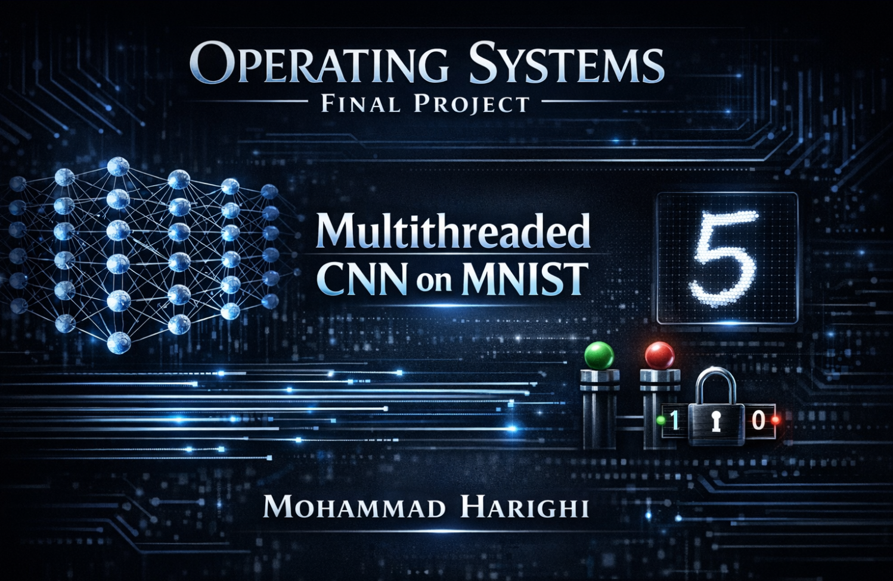

# Multithreaded CNN Training on MNIST (Operating Systems Final Project)

This repository contains a complete, self-contained implementation of a Convolutional Neural Network (CNN) designed for the MNIST dataset. The project demonstrates core Operating Systems concepts, utilizing **native multithreading** and synchronization primitives like **Semaphores** and **Locks** to safely manage training, model states, and asynchronous requests.

Developed by **Mohammad Harighi** as the Final Project for the Operating Systems course.

---

## 🚀 Getting Started

To ensure all folder structures and dependencies are correctly placed, the project is provided as a compressed package. Follow these steps to run the project on your local machine:

### 1. Download and Extract
- Download `cnnproject.zip` from this repository.
- Extract the contents to a folder of your choice.
Enter the extracted folder
Suggestion: Navigate to the following folder after extracting the project:

OS-Project-MNIST-Multithreading-main/OS-Project-MNIST-Multithreading-main/cnnproject/cnn_project/cnn_project

### 2. Create and Activate Virtual Environment
Open your terminal or command prompt inside the extracted folder and run:
after extract 
**Windows:**
```bash
python -m venv venv
venv\Scripts\activate
```

**macOS/Linux:**
```bash
python3 -m venv venv
source venv/bin/activate
```

### 3. Install Dependencies
Once the virtual environment is active, install the necessary libraries:
```bash
pip install Flask numpy tensorflow Pillow
```


### 4. Run the Application
Start the Flask server by running:
```bash
python app.py
```

After starting the server, open your web browser and navigate to:
```
http://127.0.0.1:5000/
```

---

## 🛠 OS Concepts Implemented

- **Asynchronous Training Thread:** The training loop runs on a dedicated background thread to keep the UI responsive.
- **Thread Synchronization:**
  - **Mutex Locks:** Used to protect shared model weights during simultaneous training and prediction.
  - **Semaphores:** Utilized for managing access to shared resources and signaling between threads.
- **Concurrent Requests:** The backend handles multiple prediction requests from the frontend while training is in progress.

---

## 📁 Project Structure

- **`cnn.py`:** Core neural network logic and multithreaded training implementation.
- **`app.py`:** Flask web server and thread management logic.
- **`index.html`:** Interactive dashboard and drawing canvas for users.

---

## 🎨 How to Use
1. **Configure:** Set your desired learning rate and epochs on the web UI.
2. **Train:** Hit "Start Training" and watch the real-time accuracy/loss graphs.
3. **Predict:** Use the canvas to draw a digit (0-9) and see the CNN predict it instantly using the latest trained weights.
---
## How to Run & Usage Guide

To understand how to set up, run, and interact with this project, you can watch the step-by-step walkthrough video:

[](https://my.files.ir/drive/s/4GOsmfj1VtXZEtYUKPoEcfcn9au6Z8)

> 💡 **Note:** This video covers the environment setup, running the main scripts, and a demonstration of the project in action.

---

## Developer Info

- **Developer:** Mohammad Harighi
- **Role:** Computer Engineering Student
- **Course:** Operating Systems Final Project
